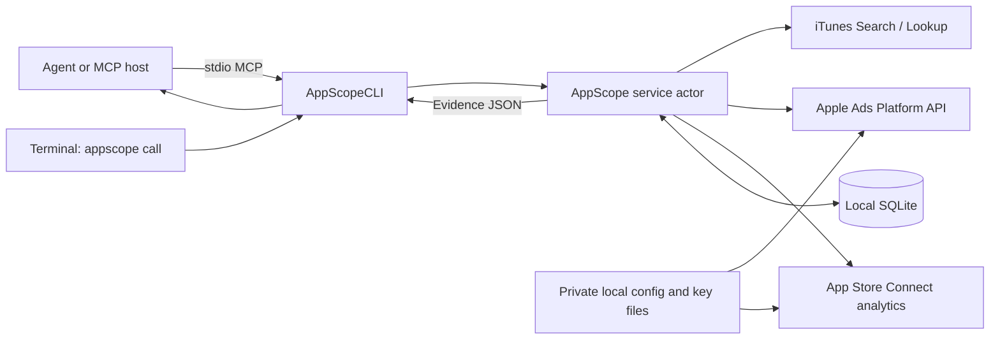

# Architecture

AppScope separates transport, collection and interpretation. The MCP host owns
the conversation, model, scheduling and report delivery. The Swift executable
owns bounded Apple requests and local evidence. The same service implements MCP
and direct CLI tool calls.

## Source map

Paths are relative to a source checkout. Compiled archives include this handbook,
not the source tree.

| Path | Responsibility |
|---|---|
| `Sources/AppScopeCLI/Main.swift` | CLI dispatch, private setup and official SDK stdio server |
| `Sources/AppScopeCore/Tools.swift` | Tool names, argument schemas, annotations and validation |
| `Sources/AppScopeCore/Service.swift` | Tool orchestration, cache decisions, batch refresh and agent briefings |
| `Sources/AppScopeCore/Refresh.swift` | Durable refresh steps and per-app/country OS locks |
| `Sources/AppScopeCore/Insights.swift` | Source health, daily aggregation, trends and change candidates |
| `Sources/AppScopeCore/Experiments.swift` | Immutable experiment definitions/baselines and revision-checked notes/status |
| `Sources/AppScopeCore/Setup.swift` | Private key generation, atomic credential configuration and live checks |
| `Sources/AppScopeCore/Ranking.swift` | Public catalog adapter, observed positions and competition model |
| `Sources/AppScopeCore/AppleAds.swift` | OAuth token exchange, suggestions and periodic popularity |
| `Sources/AppScopeCore/Analytics.swift` | App Store Connect resources, report downloads, parsing and summaries |
| `Sources/AppScopeCore/Database.swift` | SQLite schema, local records, snapshots and transactions |
| `Sources/AppScopeCore/Config.swift` | Config loading, private-file checks and ES256 signing |
| `Sources/AppScopeCore/HTTP.swift` | Ephemeral networking, bounded responses, retries and search pacing |
| `Sources/AppScopeCore/JSON.swift` | JSON helpers, dates, validation and sanitized errors |
| `Sources/AppScopeCore/Version.swift` | Executable/server version |
| `Sources/CSQLite`, `Sources/CZlib` | System-library module maps |
| `Tests/AppScopeTests` | Synthetic provider tests and real MCP subprocess coverage |
| `DevTools/AppScopeDocs` | Source-derived tool reference and documentation checks; not shipped as an installed command |
| `scripts` | Source/binary installation, universal packaging and tap formula generation |

Dependencies are pinned in `Package.resolved`. The official MCP Swift SDK supplies
the protocol implementation. Foundation, CryptoKit, system SQLite and zlib handle
the platform work. There is no web framework, embedded LLM or Python runtime.

## Request lifecycle

1. The CLI/MCP handler accepts a named tool and JSON object.
2. `ToolCatalog.validate` rejects missing/unknown arguments and invalid schema
   types/limits. Service-level validation handles app IDs, normalized keywords,
   countries and dates.
3. The service reads local records or invokes an Apple adapter. A ranking may
   reuse the latest matching snapshot for 15 minutes.
4. Valid observations/imports are saved before returning evidence. Each rank
   includes source, country, collection date and actual/requested search depth.
5. MCP returns JSON in text content and structured content. Known top-level errors
   become sanitized error objects with `isError: true`. Batch/performance tools
   can instead return explicit partial results with preserved valid data.

The service and database are actors. Actor isolation does not make an entire
network operation a database transaction: cross-process tracking limits and
report replacement use explicit SQLite transactions. Search pacing is per HTTP
actor/process, not a shared service-wide quota across multiple server processes.

## Persistence

`records` stores JSON values by kind/key: app briefs, country-specific metadata,
tracked terms, suggestion observations, imported analytics and cached performance
summaries, refresh runs/pointers and experiment records. New record kinds reuse
the existing schema; v0.2 requires no destructive database migration. `snapshots` stores keyword observations with indexed app/country/term/time.
SQLite uses WAL. New data directories use mode 0700 and the database uses 0600.

Rank changes use a comparable prior UTC date from the latest 300 observations for
that term. Snapshot popularity is evidence from the moment of collection: later
suggestions do not rewrite existing history. A report reads the newest snapshot
for each selected keyword, then identifies absent/stale entries.

Analytics imports validate all segments of an instance before saving it. A later
processing date replaces the complete older date batch atomically. If a later
instance fails, previously completed imports remain valid. Summaries preserve
missing metrics and coverage and do not sum segmented unique counts.

There is no automatic pruning or user-facing history-deletion tool in v0.2.
Untracking preserves history. Schema/data changes in future releases need a
documented migration/backup strategy; do not assume a binary downgrade can read a
newer database. See [backup instructions](SETUP.md#backup-and-restore).

## Network and trust boundaries

Apple endpoints and request shapes are fixed in adapters. Account JWTs are signed
from private files and tokens remain in memory. App Store Connect pagination
stays on its API host; signed report downloads use accepted HTTPS hosts, no bearer
token and no redirects. The transport bounds responses and decompression and
withholds raw provider error bodies. See [security](../SECURITY.md) for limits.

The server is a normal process running as the local user, not a sandbox against
its host. Any connected agent can read the private data returned by permitted
tools. Metadata and briefs are untrusted text. Neither the MCP handler nor ASO
heuristics execute instructions from that text.

## Extending the project

Add providers behind the injectable `HTTPTransport` boundary and use synthetic
responses. Add a tool to `ToolCatalog.all`, its service dispatch, a valid example
in `examples/tool-calls.json`, appropriate behavioral tests and the response guide.
Then run `swift run appscope-docs` and review the generated tool reference/catalog.

Keep strategy as evidence plus explicit hypotheses. A provider with a different
rank or demand definition needs its own source/version labels and comparison
rules. Do not silently merge unlike metrics. Follow the
[contribution guide](../CONTRIBUTING.md) and [data contract](DATA-CONTRACT.md).
